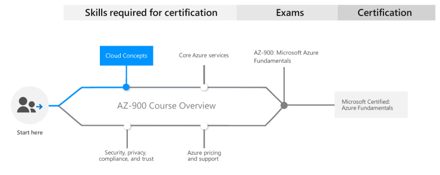
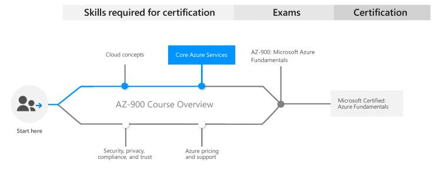

# AZ-900 Microsoft Azure Fundamentals Notes

> AZ-900 Microsoft Azure Fundamentals certification is the first and the most important certification for anyone who is just starting with Azure.

Path Overview

## Module 1

🔷<b>Describe cloud concepts (15-20%)</b>

### Cloud Computing, High Availability, Scalability, Elasticity, Agility, Fault Tolerance, and Disaster Recovery

#### Cloud Computing

Service delivery model over the internet (cloud). This includes but is not limited to:

<ul><li><b>Compute Power</b>  meaning servers such as windows, linux, hosting environments, etc.</li>
<li><b>Storage</b>  like files and/or databases</li>
<li><b>Networking</b>  in azure but also outside when connecting to your company network</li>
<li><b>Analytics</b>  services for visualization and telemetry data</li></ul>

Cloud computing is a delivery model for four service types:

<ul><li>Storage</li>
<li>Compute Power</li>
<li>Analytics</li>
<li>Networking</li></ul>

##### Key concepts

<ul><li><b>Scalability</b> - the ability to scale, so allocate and deallocate resources at any time</li>
<li><b>Elasticity</b> - the ability to scale dynamically</li>
<li><b>Agility</b> - the ability to react fast (scale quickly)</li>
<li><b>Fault Tolerance</b> - the ability to maintain system uptime while physical and service component failures happen</li>
<li><b>Disaster Recovery</b> - the process and design principle which allows a system to recovers from natural or human induced disasters</li>
<li><b>High Availability</b> - the agreed level of operational uptime for the system. It is a simple calculation of system uptime versus whole lifetime of the system.</li>
<li><b>Availability</b> = uptime/(uptime + downtime)</li></ul>

##### SUMMARY

<ul>

</ul>

### Principles of economies of scale

#### Economies of Scale

The principle of economies of scale states that as the companies grow they become more effective at managing shared operations. Be that HR and hiring, taxes, accounting, internal operations, marketing, big purchases via contracts meaning better discounts, etc. etc.

Because of those, companies can save/earn more which in return allows for reduction in cost of their services to their customers. This is so called ‘price per unit’.

It’s not possible to go to 0 because in the end some underlying infrastructure needs to run to provide the services. But the larger the scale the more benefits can be passed to customers.

In fact, in the current scale, Microsoft can already offer multiple services for free due to how small a fraction of the cost it is for them.

### Capital Expenditure (CapEx) vs Operational Expenditure (OpEx) and their differences

#### CapEx vs OpEx

Differences between Capital Expenditure and Operational Expenditure
|| Capital Expenditure | Operational Expenditure |
| --- | --- | --- |
| Up front cost | Significant | None |
| Ongoing cost | Low | Based on usage |
| Tax Deduction | Over time | Same year |
| Early Termination | No | Anytime |
| Maintenance | Significant | Low |
| Value over time | Lowers | No change |

### Consumption-based model

#### What is a consumption-based model?

The consumption-based model is a pricing model used in the cloud so that customers are only charged based on their resource usage.

This model is characterized by

<ul>
<li><b>No associated upfront cost</b></li>
<li><b>No wasted resources</b> as such no charges are incurred for unused resources*. Unused in this case is different per service. For instance, blob storage that stores any data is considered to be used, as it consumes the storage space. Virtual Machines that are running consume CPU, memory and other resources even if there isn’t any traffic. Hence they are considered to be used and will incur charges.</li>
<li><b>Pay for what you need</b></li>
<li><b>Stop paying when you don’t</b></li></ul>

<b>Consumption</b> is the virtual metric used to calculate how much each resource (service) in Azure was used. Each service has many smaller metrics that track its consumption to offer best possible pricing model. Those metrics are tracked on very granular level.

### IaaS, PaaS, SaaS and their differences

#### Service Models responsibilities

As a service means which party will manage the particular layer and all the layers below.

<ul><li>Software layer consists the application (application code and set) & the application data</li>
<li>Platform layer means all the supporting software and the operating system required to host the application</li>
<li>Infrastructure layer consists hardware the infrastructure and virtualization required to host the platform</li></ul>

| Layer            | Layer          |
| ---------------- | -------------- |
| Application      | Software       |
| Data             | Software       |
| Runtime          | Platform       |
| Middleware       | Platform       |
| Operating System | Platform       |
| Virtualization   | Infrastructure |
| Servers          | Infrastructure |
| Networking       | Infrastructure |
| Storage          | Infrastructure |

#### Responsibility Matrix

As such following table represents responsibilities
| Layer | On-Premises | IaaS | PaaS | SaaS |
| --- | --- | --- | --- | --- |
| Application | You | You | You | Cloud provider |
| Data | You | You | You | Cloud provider |
| Runtime | You | You | Cloud provider | Cloud provider |
| Middleware | You | You | Cloud provider | Cloud provider |
| Operating System | You | You | Cloud provider | Cloud provider |
| Virtualization | You | Cloud provider | Cloud provider | Cloud provider |
| Servers | You | Cloud provider | Cloud provider | Cloud provider |
| Networking | You | Cloud provider | Cloud provider | Cloud provider |
| Storage | You | Cloud provider | Cloud provider | Cloud provider |

### Episode 6: Public, Private, Hybrid cloud and their differences

#### Cloud Deployment Model

<b>Cloud Deployment Model</b> is simple a separation which describes where are the company resources deployed. Whenever this is in public cloud provider environment or private datacenter.

Below table presents high level deployment model separation

| Layer   | Cloud Provider | Own Datacenter |
| ------- | -------------- | -------------- |
| Public  | ✅             | ✖              |
| Hybrid  | ✅             | ✅             |
| Private | ✖              | ✅             |

#### Public Cloud

| Cloud Provider | Own Datacenter |
| -------------- | -------------- |
| ✅             | ✖              |

##### Key Characteristics

Everything runs on cloud provider hardware
No local hardware
Some services share hardware with other customers

##### Advantages

<ul><li>No CapEx (No initial investment)</li>
<li>High Availability</li>
<li>Agility</li>
<li>Pay as you Go (PAYG) pricing</li>
<li>No hardware maintenance</li>
<li>No deep technical skills required</li></ul>

##### Disadvantages

<ul><li>Not all security and compliance policies can be met</li>
<li>No ownership over the physical infrastructure</li>
<li>Rare specific scenarios can’t be done</li></ul>

#### Private Cloud

| Cloud Provider | Own Datacenter |
| -------------- | -------------- |
| ✖              | ✅             |

##### Key Characteristics

<ul><li>Everything runs on your own datacenter</li>
<li>Self-service should be provided</li>
<li>You maintain the hardware</li></ul>

##### Advantages

<ul><li>Can support any scenario</li>
<li>Total control over security and infrastructure</li>
<li>Can meet any security and compliance policy</li></ul>

##### Disadvantages

<ul><li>Initial investment is required (CapEx)</li>
<li>Limited agility constrained by server capacity and team skills</li>
<li>Very dependent on IT skills & expertise</li></ul>

#### Hybrid Cloud

| Cloud Provider | Own Datacenter |
| -------------- | -------------- |
| ✅             | ✅             |

##### Key Characteristic

<ul><li>Combines both Public & Private cloud</li></ul>

##### Advantages

<ul><li>Great flexibility</li>
<li>You can run any legacy apps in private cloud</li>
<li>Can utilize existing infrastructure</li>
<li>Meet any security& compliance requirements</li>
<li>Can take advantage of all public cloud benefits</li></ul>

##### Disadvantages

<ul><li>Can be more expensive</li>
<li>Complicated to manage due to larger landscape</li>
<li>Most dependent on IT skills & expertise from all three models</li></ul>

## Module 2

🔷 Describe core Azure services (30-35%)

Describe the core Azure architectural components

### Episode 7: Azure Regions and Availability Zones

#### Data Center

<ul><li><b>Physical facility</b></li>
<li><b>Hosting for</b> group of networked servers</b></li>
<li>Own <b>power, cooling & networking</b> infrastructure</li></ul>

#### Region

<ul><li><b>Geographical area</b> on the planet</li>
<li><b>One but usually more datacenters</b> connected with <b>low-latency network</b> (<2 milliseconds)</li>
<li><b>Location</b> for your services</li>
<li>Some services are <b>available only in certain regions</b></li>
<li>Some services are <b>global services</b>, as such are not assigned/deployed in specific region</li>
<li>Globally available with <b>50+ regions</b></li>
<li>Special <b>government regions</b> (US DoD Central, US Gov Virginia, etc.)</li>
<li>Special <b>partnered regions</b> (China East, China North)</li></ul>

#### Availability Zone

<ul><li><b>Regional feature</b></li>
<li>Grouping of <b>physically separate</b> facilities</li>
<li>Designed to <b>protect from data center failures</b></li>
<li>If zone goes down <b>others continue working</b></li>
<li>Two service categories</li>
    <ul><li>Zonal services (Virtual Machines, Disks, etc.)</li>
    <li>Zone-redundant services (SQL, Storage, etc.)</li></ul>
<li>Not all regions are supported</li>
<li>Supported region has three or more zones</li>
<li>A zone is one or more data centers</li></ul>

#### Region Pair

<ul><li>Each region is paired with another region making it a region pair</li>
<li>Region pairs are static and cannot be chosen</li>
<li>Each pair resides within the same geography*</li>
    <ul><li>Exception is Brazil South</li></ul>
<li>Physical isolation with at least 300 miles distance (when possible)</li>
<li>Some services have platform-provided replication</li>
<li>Planned updates across the pairs</li>
<li>Data residency maintained for disaster recovery</li></ul>

| Region Pair A          | Region Pair B              |
| ---------------------- | -------------------------- |
| East US                | West US                    |
| UK West                | UK South                   |
| North Europe (Ireland) | West Europe (Netherlands)  |
| East Asia (Hong Kong)  | Southeast Asia (Singapore) |

#### Geographies

    Discrete market
    Typically contains two or more regions
    Ensures data residency, sovereignty, resiliency, and compliance requirements are met
    Fault tolerant to protect from region wide failures
    Broken up into areas
        Americas,
        Europe,
        Asia Pacific,
        Middle East and Africa
    Each region belongs only to one Geography

### Episode 8: Azure Resource Groups and Resource Manager

Describe some of the core products available in Azure

### Episode 9: Azure Compute Services | Virtual Machine, VM Scale Set, App Service, Functions, Container ### Instances, Kubernetes Service

### Episode 10: Azure Networking Services | Virtual Network, Load Balancer, VPN Gateway, Application ## #Gateway, CDN

### Episode 11: Azure Storage Services | Blob, Disk, File and Archive

### Episode 12: Database Services | Cosmos DB, SQL Database, SQL DB for MySQL and PostgreSQL, SQL Managed ### Instance

### Episode 13: Azure Marketplace

Describe some of the solutions available on Azure

### Episode 14: Azure IoT Services | IoT Hub, IoT Central, Azure Sphere

### Episode 15: Azure Big Data and Analytics Services | Synapse Analytics (SQL Datawarehouse), HDInsight, ### Databricks

### Episode 16: Azure Artificial Intelligence (AI) Services | Machine Learning Studio and Service

### Episode 17: Azure Serverless Computing Services | Functions, Logic Apps, Event Grid

### Episode 18: Azure DevOps Solutions | Azure DevOps, DevTest Labs

Describe Azure management tools

### Episode 19: Azure Tools | Portal, PowerShell, CLI and CloudShell

### Episode 20: Azure Advisor

## Module 3

🔷 Describe Security, Privacy, Compliance, and Trust (25-30%)

Describe securing network connectivity in Azure

### Episode 21: Security Groups | NSG and ASG | Network Security Groups and Application Security grouyps

### Episode 22: User-defined Routes (UDR)

### Episode 23: Azure Firewall

### Episode 24: Azure DDoS Protection

Describe core Azure Identity services

### Episode 25: Azure Identity Services | Identity, Authentication, Authorization & Azure AD

Describe security tools and features of Azure

### Episode 26: Azure Security Center and usage scenarios

### Episode 27: Key Vault

Describe Azure governance features

### Episode 28: Role-Based Access Control (RBAC)

### Episode 29: Resource Locks

### Episode 30: Tags

### Episode 31: Azure Policy

### Episode 32: Azure Blueprints

### Episode 33: Cloud Adoption Framework

Describe privacy and compliance resources

### Episode 34: Core tenets of Security, Privacy, and Compliance

## Module 4

Describe Azure cost management and Service Level Agreements (10-15%)
Describe methods for planning and managing costs

### Episode 35: Cost Affecting Factors

### Episode 36: Cost Reduction Methods and Pricing, TCO Calculators

### Episode 37: Azure Cost Management

Describe Azure Service Level Agreements (SLAs) and service lifecycles

### Episode 38: Azure Service Level Agreement (SLA)

### Episode 39: Service lifecycle in Azure
