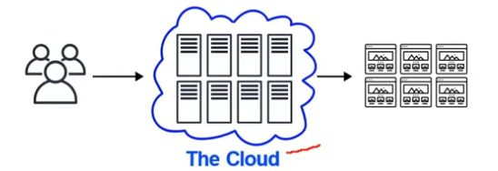
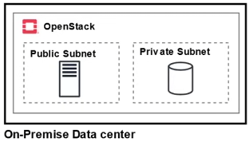
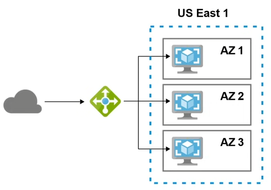
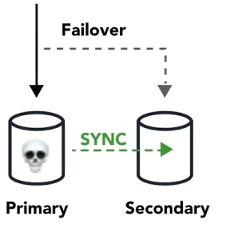
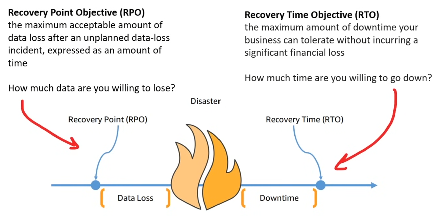

# AZ-900 Notes

  

## Value

Azure Fundamentals provides the most expansive view of Cloud architecture and Azure.

NOTE: Bird's-eye view - think foundation.

## Length of Study

---

## Why Cloud Computing?

1. High Speed - Quick Deployment
2. Automatic Software Updates and Integration
3. Efficiency and Cost Reduction
4. Unlimited Storage Capacity
5. Scalability

## Cloud Hosting Evolution

### Dedicated Server

- One physical machine dedicated to a single business.
- Runs a single web-app/site.
- **Very expensive, High Maintenace, High Security**

### Virtual Private Server (VPS)

- One physical machine dedicated to a single business.
- The physical machine is virtualized into sub-machines.
- Runs multiple web-apps/sites.
- **Better utilization and isolation of resources.**

### Shared Hosting

- One physical machine, shared by hundreds of businesses.
- Relies on most tenants under-utilizing their resources.
- Very cheap, limited functionality, poor isolation.

### Cloud Hosting

- Muliple physical machines that act as one system.
- The system is abstracted into multiple cloud services.
- **Flexible, scalable, secure, cost-effective, high configurability.**

## Common Cloud Services

A cloud provider can have hundreds of cloud services that are grouped various types of services. The four most common types of cloud services for Infrastructure as a Service (IaaS) would be:

- Compute
- Storage
- Networking
- Databases

The term "cloud computing" can be used to refer to all categories, even though it has "compute" in the name.

### Compute

Imagine having a virtual computer that can run applications, programs, and code.

### Storage

Imagine having a virtual hard-drive that can store files.

### Networking

Imagine having a virtual network being able to define internet connections or network isolations.

### Databases

Imagine a virtual database for storing reporting data or a database for general purpose web-application.

## Cloud Services Models

<table class="tg">
<thead>
  <tr>
    <th class="tg-0lax">SaaS </th>
    <th class="tg-0lax">PaaS</th>
    <th class="tg-0lax">IaaS</th>
  </tr>
</thead>
<tbody>
  <tr>
    <td class="tg-0lax">SaaS is a cloud-hosted, ready-to-use application software.
    <b>Don't worry about how the service is maintained. It just works and remains available.</b></td>
    <td class="tg-0lax">PaaS provides a cloud-based platform for developing, running, and managing applications.
    <b>Don't worry about, provisioning, configuring, or understanding the hardware or OS.</b></td>
    <td class="tg-0lax">IaaS is a type of cloud computing service that offers essential compute, storage, and networking resources on demand, on a pay-as-you-go basis.
    <b>Don't worry about IT staff, data centers and hardware.</b></td>
  </tr>
  <tr>
    <td class="tg-0lax">
    
    
    
    </td>
    <td class="tg-0lax"></td>
    <td class="tg-0lax">
    
    
    </td>
  </tr>
</tbody>
</table>

## Benefits of Cloud Computing

| Benefit        | Desc.                                                                                                                             |
| -------------- | --------------------------------------------------------------------------------------------------------------------------------- |
| Cost-effective | You pay for what you consume, no up-front cost. Pay-as-you-go (PAYG) thousands of customers sharing the cost of resources.        |
| Global         | Launch workloads anywhere in the world, just choose a region.                                                                     |
| Reliable       | data backup, disaster recovery, and data replication, and fault tolerance                                                         |
| Scalable       | Increase or decrease resources and services based on demand                                                                       |
| Elastic        | Automate scaling during spikes and drop in demand                                                                                 |
| Current        | The underlying hardware and managed software is patched, upgraded and replaced by the cloud provider without interruption to you. |

## What is Azure?

Azure is Microsoft's cloud computing platform with an ever-expanding services to help build solutions to meet your business goals.

## Azure Benefits

- High Availability / Disaster recovery
- Security
- Enhanced Flexibility
- Low Cost
- Speed

## Cloud Computing Responsibilities

<table class="tg">
<thead>
  <tr>
    <th class="tg-0pky">On-Premise</th>
    <th class="tg-0pky">IaaS</th>
    <th class="tg-0pky">PaaS</th>
    <th class="tg-0pky">SaaS</th>
  </tr>
</thead>
<tbody>
  <tr>
    <td class="tg-ra6b">Applications</td>
    <td class="tg-djj2">Applications</td>
    <td class="tg-ra6b">Applications</td>
    <td class="tg-9rbh">Applications</td>
  </tr>
  <tr>
    <td class="tg-djj2">Data</td>
    <td class="tg-djj2">Data</td>
    <td class="tg-djj2">Data</td>
    <td class="tg-9rbh">Data</td>
  </tr>
  <tr>
    <td class="tg-djj2">Runtime</td>
    <td class="tg-djj2">Runtime</td>
    <td class="tg-9rbh">Runtime </td>
    <td class="tg-9rbh">Runtime</td>
  </tr>
  <tr>
    <td class="tg-djj2">Middleware</td>
    <td class="tg-djj2">Middleware</td>
    <td class="tg-9rbh">Middleware</td>
    <td class="tg-9rbh">Middleware</td>
  </tr>
  <tr>
    <td class="tg-djj2">OS</td>
    <td class="tg-djj2">OS</td>
    <td class="tg-9rbh">OS </td>
    <td class="tg-9rbh">OS</td>
  </tr>
  <tr>
    <td class="tg-djj2">Virtualization</td>
    <td class="tg-9rbh">Virtualization</td>
    <td class="tg-9rbh">Virtualization</td>
    <td class="tg-9rbh">Virtualization</td>
  </tr>
  <tr>
    <td class="tg-djj2">Servers</td>
    <td class="tg-9rbh">Servers</td>
    <td class="tg-9rbh">Servers</td>
    <td class="tg-9rbh">Servers</td>
  </tr>
  <tr>
    <td class="tg-djj2">Storage</td>
    <td class="tg-9rbh">Storage </td>
    <td class="tg-9rbh">Storage</td>
    <td class="tg-9rbh">Storage</td>
  </tr>
    <tr>
    <td class="tg-djj2">Networking</td>
    <td class="tg-9rbh">Networking </td>
    <td class="tg-9rbh">Networking</td>
    <td class="tg-9rbh">Networking</td>
  </tr>
</tbody>
</table>

<table class="tg">
<thead>
  <tr>
    <td class="tg-hfk9">Legend:</td>
    <td class="tg-ra6b">Customer is Responsibile</td>
    <td class="tg-ucgi">CSP is Responsible</td>
  </tr>
</thead>
</table>

## Azure's Deployment Models

### Public Cloud

<b>Everything</b> built on the Cloud Provider
Also known as: Cloud-Native

### Private Cloud

Everything built on company's datacenter
Also known as <b>On-Premise</b>
The Cloud could be <b>OpenStack</b>

### Hybrid

Using both <b>On-Premise</b> and a <b>Cloud Service Provider</b>

<table class="tg">
<thead>
  <tr>
    <th class="tg-0lax"></th>
    <th class="tg-0lax">Cost</th>
    <th class="tg-0lax">Security</th>
    <th class="tg-0lax">Level of Configuration</th>
    <th class="tg-0lax">Technical Knowledge</th>
  </tr>
</thead>
<tbody>
  <tr>
    <td class="tg-0lax">Public Cloud</td>
    <td class="tg-zgh4">👍 Most cost-effective</td>
    <td class="tg-ra6b">👍- Security controls by default 👎 - Might not meet security requirements</td>
    <td class="tg-1zak">👎 Limited based on what the Cloud Service Provider exposes to you</td>
    <td class="tg-zgh4">👍 You don't need in-depth knowledge of underlying infrastructure</td>
  </tr>
  <tr>
    <td class="tg-0lax">Private Cloud</td>
    <td class="tg-1zak">👎 Most Expensive</td>
    <td class="tg-ra6b">👎 - No guarantee its secure 👍 - Can meet any security compliance requirement if you put in the work</td>
    <td class="tg-zgh4">👍 You can configure the infrastructure however you like</td>
    <td class="tg-1zak">👎 You need to know in-depth knowledge to configure all levels of your instance</td>
  </tr>
  <tr>
    <td class="tg-0lax">Hybrid Cloud</td>
    <td class="tg-ra6b">👍 Could be more cost-effective based on what you offload to the cloud</td>
    <td class="tg-ra6b">👎 - You now have to secure your connection to the cloud 👍 - Can meet all security requirements</td>
    <td class="tg-zgh4">👍 You get the best of both worlds</td>
    <td class="tg-1zak">👎 You need to know in-depth how to configure all levels of your infrastructure and know all the CSPs services.</td>
  </tr>
</tbody>
</table>

## Total Cost of Ownership (TCO)

### CAPEX

On-Premise

- Implementation
- Configuration
- Training
- Physical Security
- Hardware
- IT Personnel
- Maintenance

<b>Azure's Responsibility</b>

### OPEX

Azure

- Subscription Fees
- Implementation
- COnfiguration
- Training

<b>= 75% Savings</b>

## Capital vs Operational Expenditure

### Capital Expenditure (CAPEX)

<mark>**Spending money upfront**</mark> on physical infrastructure deducting that expense from your tax bill over time.

- Server Costs (computers)
- Storage Costs (hard drives)
- Network Costs (Routers, Cables, Switches)
- Backup and Archive Costs
- Disaster Recovery Costs
- Datacenter Costs (Rent, Cooling, Physical Security)
- Technical Personnel

With Capital Expenditures <b>you have to guess upfront</b> what you plan to spend

### Operational Expenditure (OPEX)

The costs associated with an on-premises datacenter that has shifted the cost to the service provider. The customer only has to be concerned with non-physical costs.

- Leasing Software and Customizing features
- Training Employees in Cloud Services
- Paying for Cloud Support
- Billing based on cloud metrics eg.
  - compute usage
  - storage usage

With Operation Expenses you can try a product or service <b>without investing in equipment</b>

## Cloud Architecture Terminologies

### Solutions Architect

A role in a technical organization that architects a technical solution using multiple systems via researching, documentation, and experimentation.

### Cloud Architect

A solutions architect that is focued solely on architecting techniceal solutions using cloud services.

A cloud architect needs to understand the followikng terms and factor them into their designed architecture based on the business requirements.

- **Availability** - Your ability to ensure a service available eg. Highly available (HA)
- **Scalability** - Your ability to grow rapidly or unimpeded
- **Elasticity** - Your ability to shrink and grow to meet the demand
- **Fault Tolerance** - Your ability to prevent a failure
- **Disaster Recovery** - Your ability to recover from a failure eg. Highly Durable (DR)

A Solutions Architect needs to always consider the following business factors:

- Security - how secure is this solution?
- Cost - how much is this going to cost?

## High Availability

Your ability for your service to <b>remain available</b> by ensuring there is <mark>no single point of failure</mark> and/or ensure a certain level of performance.

Running your workload across multiple **Available Zones** ensures that if 1 or 2 AZs become unavailable, your service/applications remains available.

### Azure Load Balancer

A load balancer allows you to evenly distribute traffic to multiple servers in one or more datacenter. If a datacenter or server becomes unavailable (unhealthy) the load balancer will route the traffic to only available datacenters with servers.

## High Scalability

Your ability to <b>increase your capacity</b> based on the increasing demand of traffic, memory, and computing power.

## High Elasticity

Your ability to <b>automatically</b> increase or decrease your capacity based on the current demand of traffic, memory, and computing power

### Azure VM Scale Sets

Automatically increase or decrease in response to demand or a defined schedule.

### SQL Server Stretch Database

Dynamically stretch warm and cold transactional data from Microsoft SQL Server 2016 to Microsoft Azure

Vertical Scaling is generally hard for traditional architecture so you'll usually only see horizontal scaling described with Elasticity.

## Highly Fault Tolerant

Your ability for your service to ensure there is <mark>no single point of failure</mark>. <b>Preventing</b> the chance of failure.

### Fail-overs

When you have a plan to shift traffic to a redundant system in case the primary system fails.

A common example is having a copy (secondary) of your database where all ongoing changes are synced. The secondary system is not in-use until a fail over occurs and it becomes the primary database.

You can use **Azurre Traffic Manager** which is a DNS-based traffic balancer to fail-over from a failing primary system to a stand-by secondary system.

## High Durability

Your ability to <b>recover</b> from a disaster and to prevent <b>the loss</b> of data. Solutions that recover from a disaster is known as <mark>**Disaster Recover (DR)**</mark>

- Do you have a backup?
- How fast can you restore that backup?
- Does your backup still work?
- How do you ensure current live data is not corrupt?

## Business Continuity Plan (BCP)

A **business continuity plan** (BCP) is a document that outlines how a business will continue operating <b>during an unplanned disruption in services</b>.

## Disaster Recovery Options

There are multiple options for recovery that trade cost vs time to recover.

